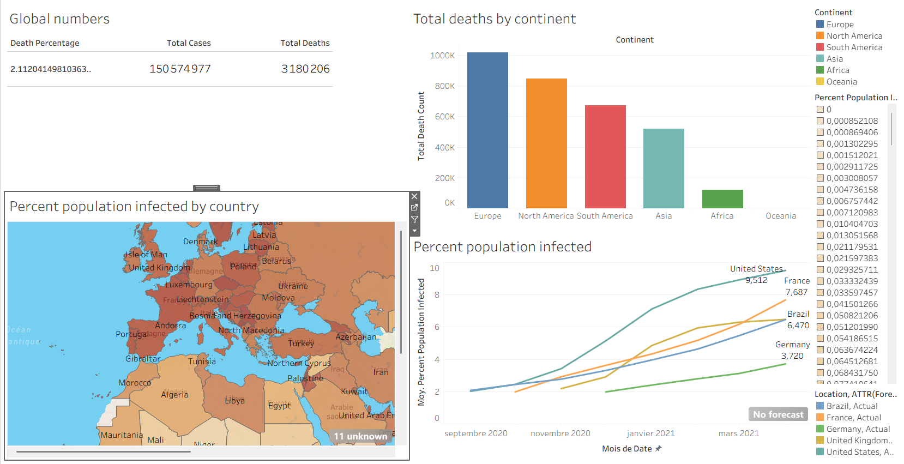

# Data Analysis

Welcome to my **Data Analytics Portfolio**! This repository showcases end-to-end data analytics projects demonstrating proficiency in **SQL (Google BigQuery)**, **Python (Pandas, Seaborn, Matplotlib)**, and **Business Intelligence / Data Visualization (Tableau)**.

### 1. COVID-19 Data Exploration (SQL)
Technologies: Google BigQuery Standard SQL

Key Skills: Common Table Expressions (CTEs), Window Functions (PARTITION BY), Aggregate Functions, Temp Tables, Self-Joins, Type Casting.

Overview: Explored historical global COVID-19 dataset to uncover infection rates relative to population, global death percentages, continental mortality distributions, and rolling vaccination progress metrics.

### 2. Movie Industry Correlation Analysis (Python)
Technologies: Python, Jupyter Notebook, Pandas, NumPy, Seaborn, Matplotlib

Key Skills: Data Cleaning, Type Standardization, Missing Value Imputation, Pearson & Spearman Correlation Matrices, Visual Regression Plotting.

Overview: Evaluated the financial drivers behind box office success across four decades of movie industry data. Tested core hypotheses regarding the correlation between production budget, company prestige, user voting scores, and gross revenue.

### 3. Nashville Housing Data Cleaning (SQL)
Technologies: Google BigQuery Standard SQL

Key Skills: Data Transformation, Missing Address Imputation via Self-Joins, String Manipulation (SPLIT, SAFE_OFFSET), Categorical Normalization (CASE statements), Window Deduplication (ROW_NUMBER()), Schema Optimization (SELECT * EXCEPT).

Overview: Transformed an unstructured, messy real estate sales dataset into a clean, analysis-ready table by resolving null values, standardizing mixed boolean flags, splitting composite address strings, and eliminating duplicate transaction records.

### 4. COVID-19 Global Impact Dashboard (Tableau)
* **Tools:** Tableau Public, SQL
* **Live Link:** [Interactive Dashboard](https://public.tableau.com/views/Classeur1_17872357427680/Dashboard1?:language=en-US&:sid=&:redirect=auth&:display_count=n&:origin=viz_share_link)
* **Summary:** Built an interactive executive dashboard displaying worldwide COVID-19 KPIs, continental death breakdowns, geospatial infection heatmaps.

## 🖼️ Dashboard Preview

